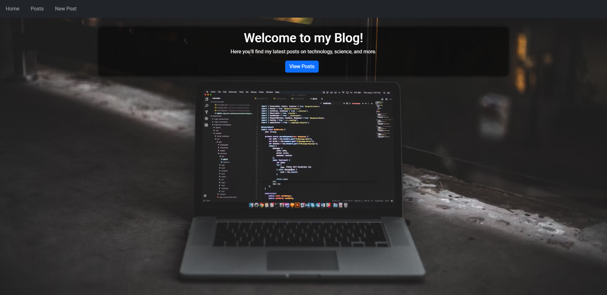
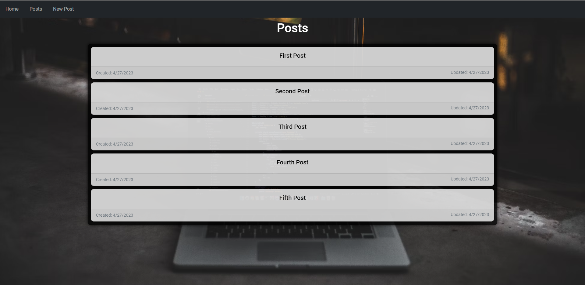
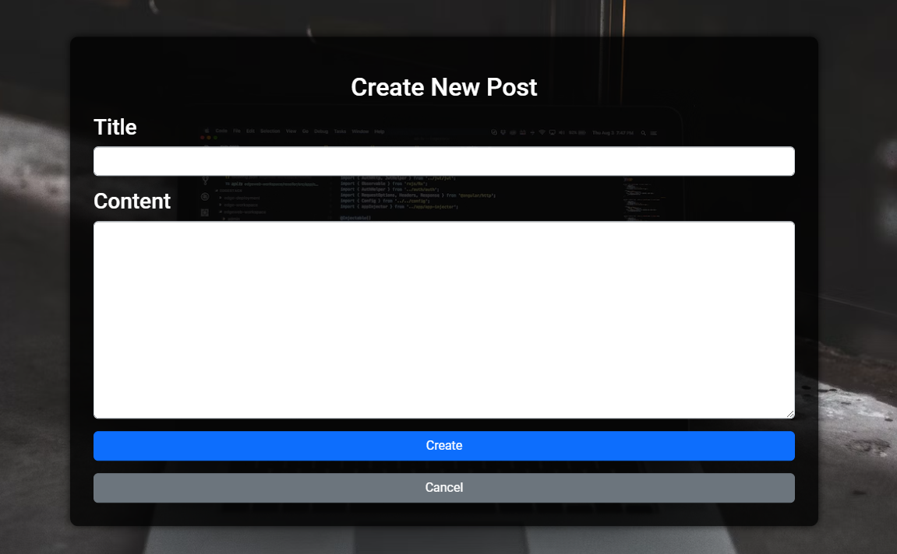
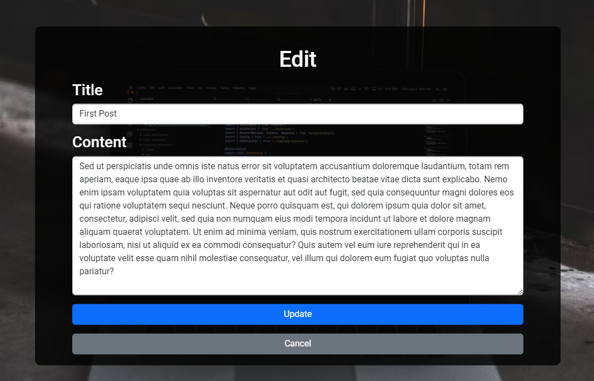
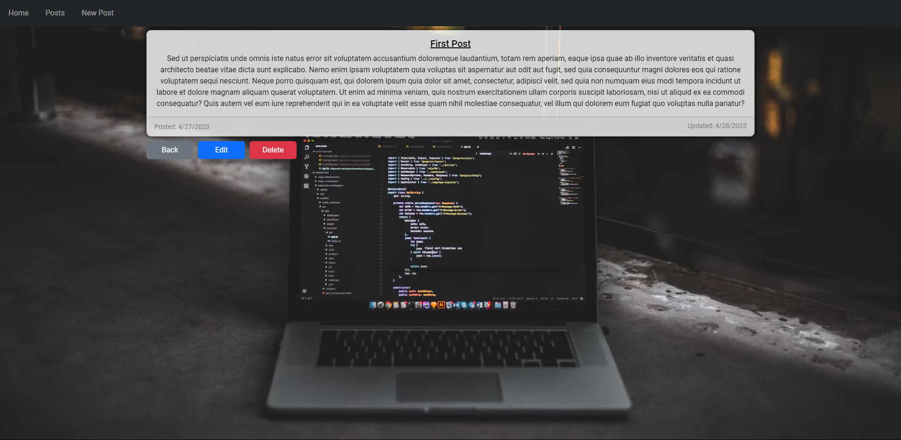
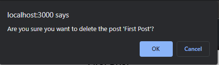

# Blog App

## Description
This is a simple blog app that allows users to create, edit, and delete blog posts. The purpose of this app is to practice using React and .NET Core API.

## Technologies Used
* React
* .NET Core API
* Bootstrap
* CSS
* HTML
* JavaScript
* C#

## Screenshots

## How to Run
1. Clone down this repo.
2. Run `npm install` to install all dependancies.
3. Run `npm start` in your terminal to start up the app.
4. Make sure you have the API running locally as well via Visual Studio or the .NET CLI.
5. Enjoy!

## Contributors
* [Alex Sanderson](https://github.com/Vexelior)